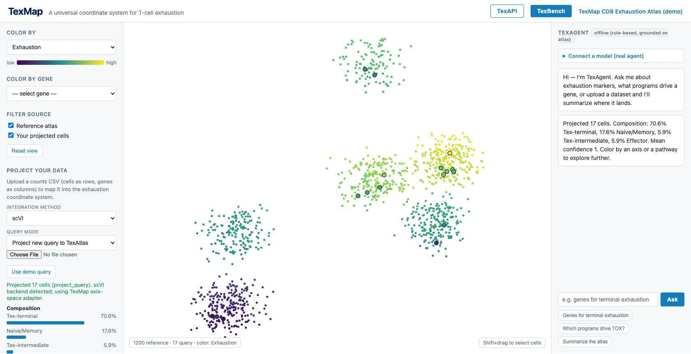
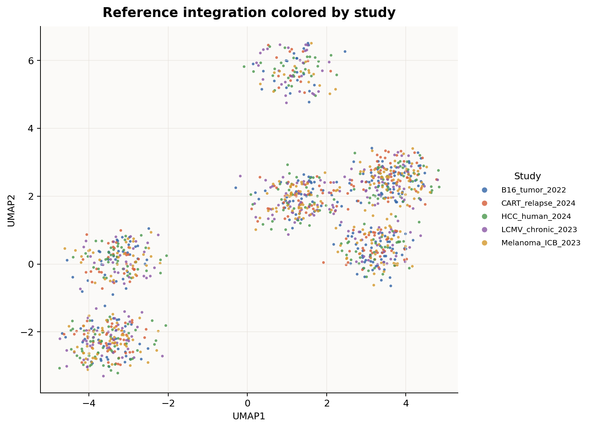
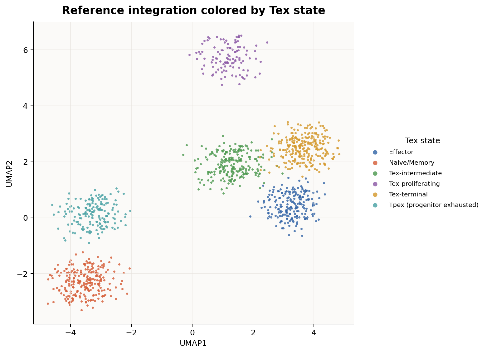
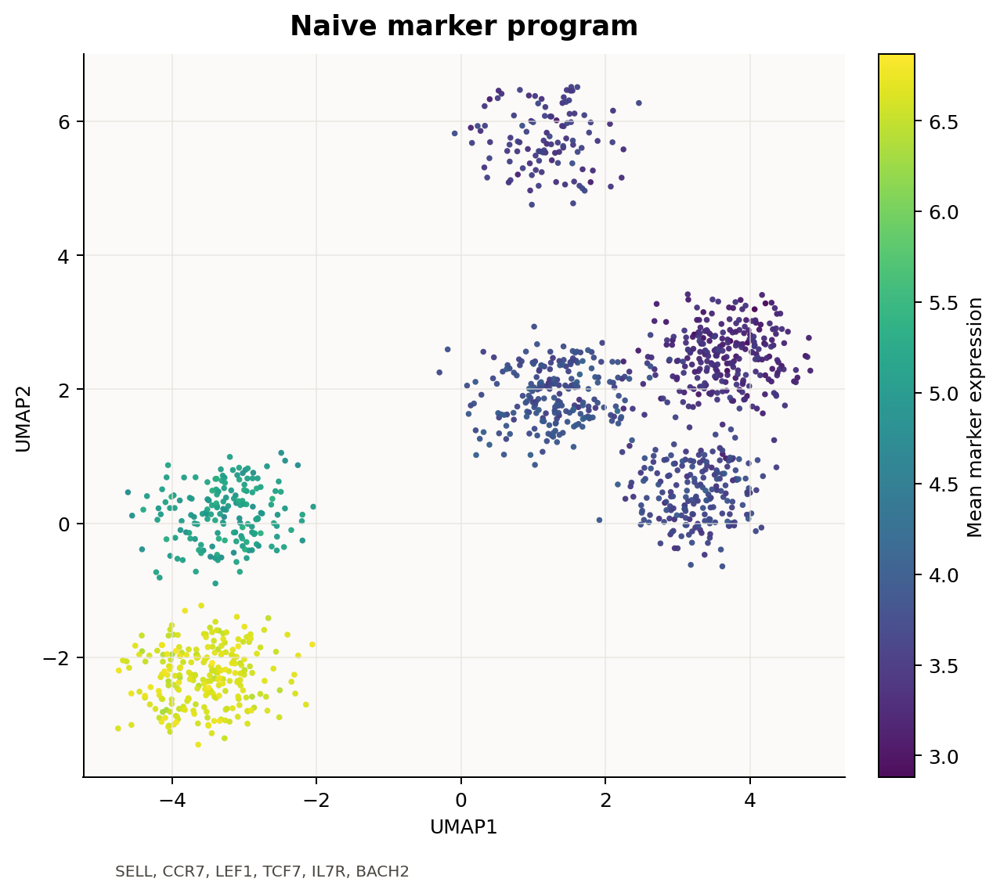
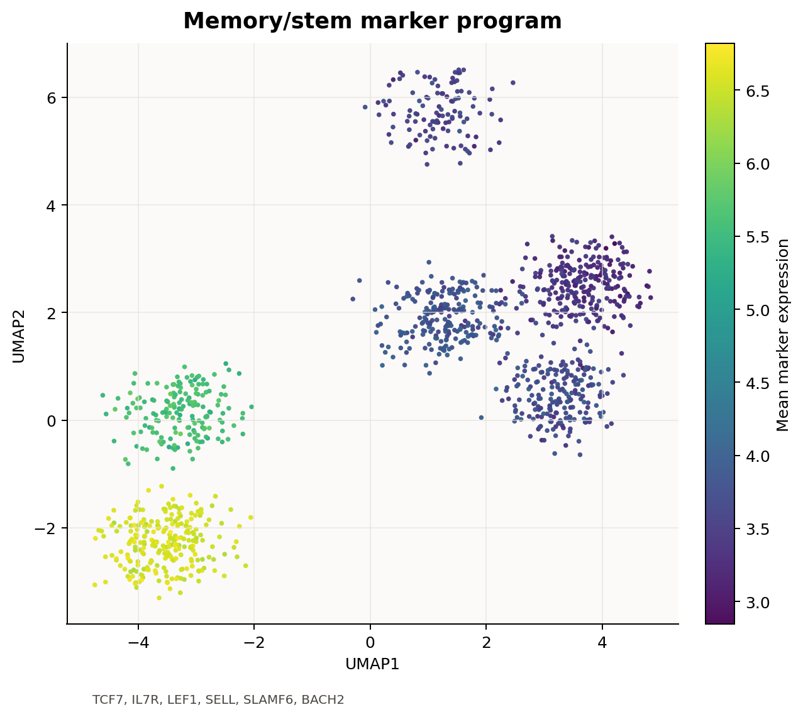
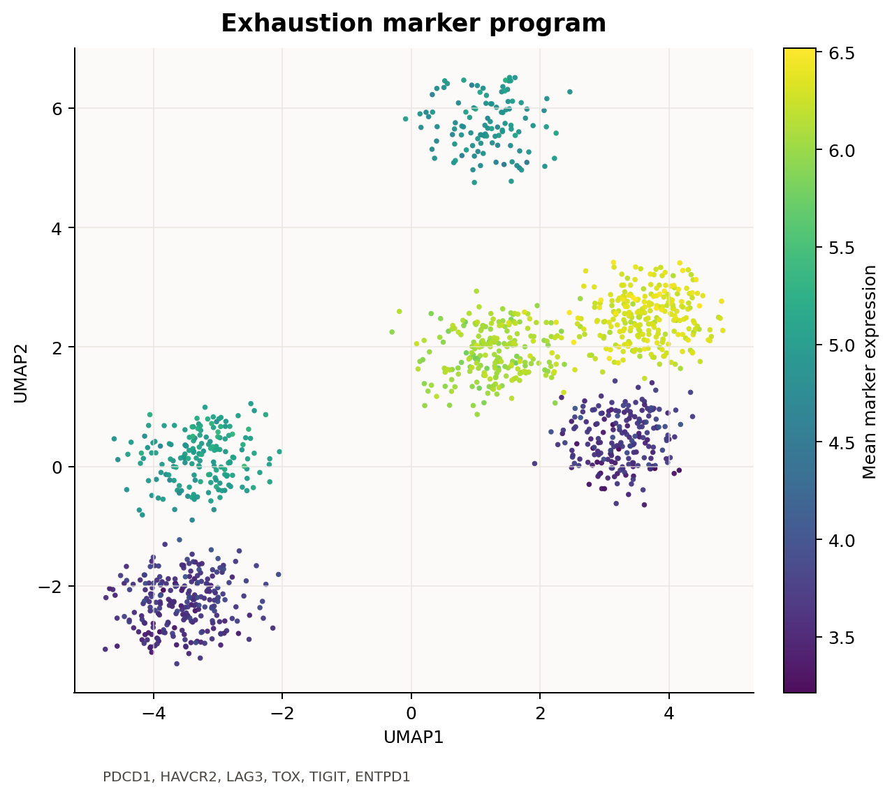
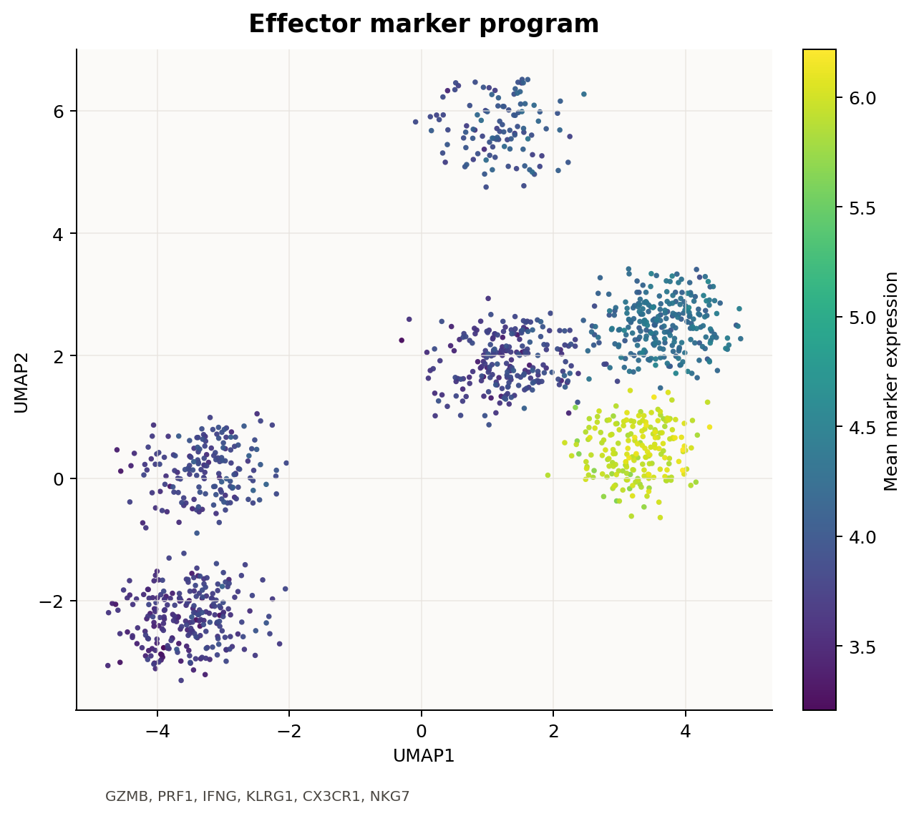
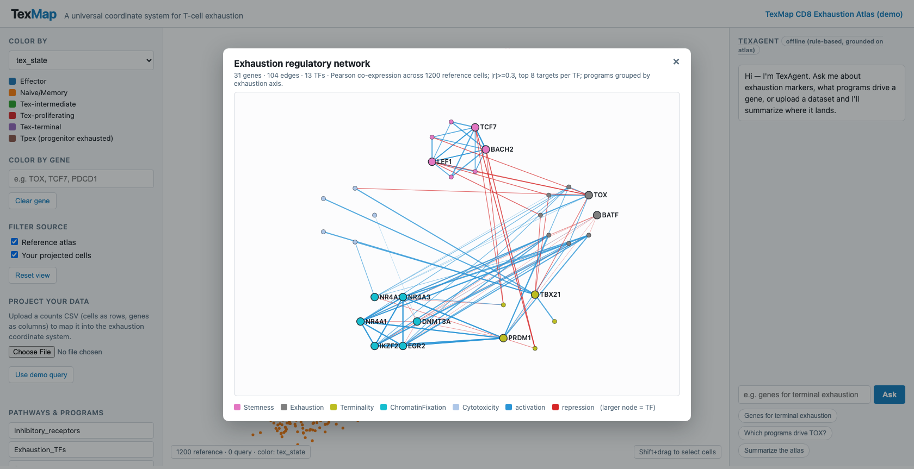
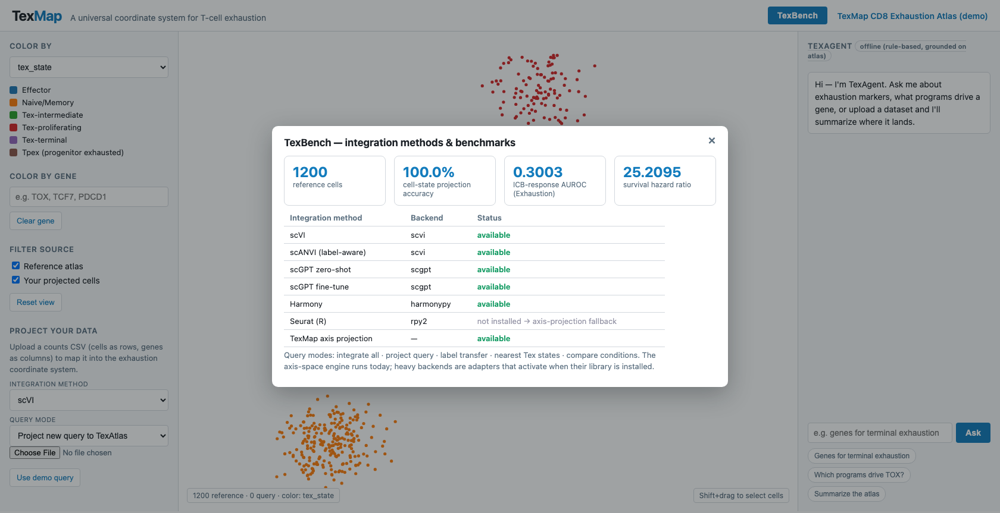
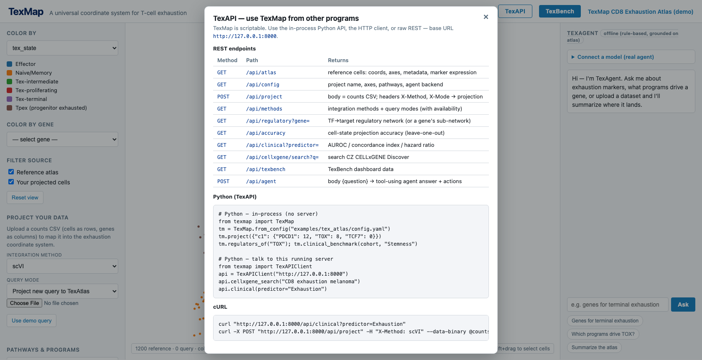

#  TexMap: A Universal Coordinate System for T Cell Exhaustion

<p align="center"><b>A universal coordinate system for T-cell exhaustion.</b><br>
An open-source reference atlas + computational framework for projection, interpretation, and
mechanistic discovery across single-cell, bulk, multiomic, and cross-species data.</p>

<p align="center">
  
  
  
  
  
  <a href="docs/tutorials/index.md"></a>
</p>

<p align="center">
  
  <br><em>The TexMap explorer — project data into the exhaustion coordinate system and explore it interactively.</em>
</p>

**Documentation & tutorials:** [docs/tutorials/index.md](docs/tutorials/index.md) ·
**Quick start:** [QUICK_START.md](QUICK_START.md) ·
**Goal & vision:** below

Instead of forcing every dataset into incompatible discrete cluster labels (one lab's
"progenitor Tex" is another's "stem-like Tex"), TexMap places every cell on a small set of
**continuous, interpretable biological axes** — Exhaustion, Stemness, Terminality,
Cytotoxicity, Proliferation, and a Chromatin-fixation proxy — and projects any new dataset
into that shared space.

TexMap ships with a real **interactive web explorer** (no build step, no heavy
dependencies) where you can browse the integrated atlas, upload your own data to see where
it lands, color by continuous axes or pathway programs, and ask a natural-language agent
about exhaustion biology.

```bash
# Generate the demo CD8 exhaustion atlas and launch the explorer
texmap demo
texmap serve --config examples/tex_atlas/config.yaml
# open http://127.0.0.1:8000
```

## Example integration results

<details>
<summary>Show integration figures</summary>

The bundled TexMap reference demonstrates integration across a biologically styled CD8
T-cell exhaustion atlas with mouse and human cells, multiple study labels, and continuous
Tex axes. These figures are generated from the checked-in `examples/tex_atlas` reference so
the README links resolve to reproducible example outputs.

**Batch integration — cells co-embed by biology, not by study of origin:**



**Cell-state structure** across naive/memory, effector, progenitor-exhausted, terminal,
and proliferating states:



**Canonical marker programs localize as expected on the integrated manifold**, validating
the embedding and TexMap's axis definitions:

| Naive | Memory |
| --- | --- |
|  |  |

| Exhaustion | Effector |
| --- | --- |
|  |  |

Naive/memory markers (SELL, CCR7, LEF1, TCF7, IL7R, SLAMF6, BACH2) mark the
right-hand islands; exhaustion markers (PDCD1, HAVCR2, LAG3, TOX, TIGIT, ENTPD1) and effector
markers (GZMB, PRF1, IFNG, KLRG1, CX3CR1, NKG7) partition the large chronic-infection
manifold — the biological structure TexMap's continuous axes are designed to quantify.

> Figure files live in [docs/figures/](docs/figures/); see the folder README for the exact
> filenames if you regenerate them.

</details>

## Interactive Web Explorer

`texmap serve` starts a dependency-free web application (Python stdlib only) with a JSON API:

| Route | Purpose |
| --- | --- |
| `GET /` | Single-page atlas explorer |
| `GET /api/atlas` | Reference cells: coordinates, continuous axes, metadata |
| `POST /api/project` | Upload a counts CSV → project into the Tex coordinate map |
| `POST /api/agent` | Ask TexAgent a natural-language question |
| `GET /api/cellxgene/search` | Search CZ CELLxGENE Discover for exhaustion datasets |
| `GET /api/regulatory[?gene=]` | Recovered TF→target regulatory network (or a gene's sub-network) |
| `GET /api/accuracy` | Cell-state projection accuracy (leave-one-out on the atlas) |
| `GET /api/clinical?predictor=` | Clinical-translation metrics (AUROC / C-index / hazard ratio) |
| `GET /api/methods` | Integration methods + query modes (with backend availability) |
| `GET /api/texbench` | TexBench dashboard data (accuracy, clinical, method availability) |

`POST /api/project` accepts `X-Method` and `X-Mode` headers to choose the integration method
and query mode.

In the browser you can: pan/zoom the atlas, color by any continuous axis / cell metadata /
pathway program / **individual gene** (cellxgene-style), toggle reference vs. your projected
cells, hover/click for per-cell detail, **shift-drag to select a region** and read its live
state composition, upload a counts matrix (or use the demo query) and watch it land with a
state-composition breakdown, and chat with TexAgent. With a configured live LLM key, TexAgent
answers grounded on the atlas; otherwise it uses a grounded offline rule-based engine.

### CELLxGENE integration (OS4Science)

TexMap connects to the broader open-science ecosystem rather than being a standalone island.
The **Query CELLxGENE** panel searches the public [CZ CELLxGENE Discover](https://cellxgene.cziscience.com/)
Curation API for exhaustion-relevant datasets and deep-links each result into the cellxgene
Explorer, so you can find a reference dataset, inspect it in cellxgene, and bring it back to
project into the TexMap coordinate system. When offline, it falls back to a curated catalog
of landmark CD8-exhaustion studies. The explorer itself adopts cellxgene's interaction model
(color-by-gene, region selection → composition) so it is familiar to that community — which
is exactly the reusable, interoperable infrastructure OS4Science is meant to fund.

## Continuous Exhaustion Coordinates

`texmap.tex_axes` scores every cell on continuous 0–1 axes from curated CD8-exhaustion
marker programs, plus a derived discrete `tex_state` for convenience:

| Axis | Meaning |
| --- | --- |
| Exhaustion | Memory ←→ Exhaustion (inhibitory-receptor / TOX program) |
| Stemness | Differentiated ←→ Stem/progenitor (TCF7 / SELL / IL7R) |
| Terminality | Plastic ←→ Terminal effector |
| Cytotoxicity | Quiescent ←→ Cytotoxic |
| Proliferation | Resting ←→ Proliferative |
| ChromatinFixation | Chromatin-open ←→ Chromatin-locked (refined with ATAC) |

These are written to `tables/tex_axes.csv` and merged into the integrated embedding so the
web explorer can color by them.

## Analysis modules

- **Integration engine** (`texmap.integration`, `GET /api/methods`) — pick a method
  (**scVI** default · scANVI · scGPT zero-shot · scGPT fine-tune · Harmony · Seurat) and a
  **query mode** (integrate all · project new query · label transfer · find nearest Tex
  states · compare conditions). TexMap detects whether each backend library is installed and
  transparently falls back to its dependency-free axis-space projection engine (and tells you
  in the result `note`). Method/mode are chosen in the **Project your data** panel.
- **TexBench** — the home-page button opens a benchmark dashboard: reference size, cell-state
  projection accuracy, clinical AUROC/hazard-ratio, and which integration backends are
  available (`GET /api/texbench`).
- **Regulatory-network recovery** (`texmap.regulatory`, `GET /api/regulatory`) — recovers a
  TF→target network from atlas co-expression (GENIE3/SCENIC-style) and groups edges into
  exhaustion programs. On the demo atlas it recovers e.g. TOX→PDCD1/LAG3/TIGIT (the
  inhibitory-receptor program) and TBX21⊣TOX. View it as a graph in the explorer.
- **Cell-state projection accuracy** (`texmap.evaluation`, `GET /api/accuracy`) — leave-one-out
  kNN label recovery in axis space → accuracy, macro-F1, per-class P/R/F1, confusion matrix.
- **Clinical translation benchmark** (`texmap.clinical`, `GET /api/clinical`) — does a Tex
  predictor (e.g. Stemness, Exhaustion) predict outcome? Computes **AUROC** (ICB response /
  infection severity / CAR-T persistence), **concordance index** and a single-covariate Cox
  **hazard ratio** with Wald p-value (survival). All implemented from scratch, no numpy.
- **Multiomic & cross-species mapping** — scATAC peaks → gene activity and bulk RNA both
  project onto the shared map (`tables/scatac_projection.csv`, `bulk_rna_projection.csv`);
  axis-space projection is species-agnostic, so a mouse-cased query harmonizes onto the atlas
  (`examples/tex_atlas/crossspecies_mouse_query.csv`).
- **TexAPI** (`texmap.TexMap`, `texmap.TexAPIClient`) — in-process Python API and an HTTP
  client so other programs can project data and run analyses.
- **Real-time TexAgent** (`texmap.texagent`) — a **tool-using agent**, not just a chatbot. With
  an LLM key (Gemini / OpenAI, free-first auto-detection) it runs a ReAct loop, calling
  real tools (`atlas_composition`, `axis_markers`, `regulators_of`, `projection_accuracy`,
  `clinical_benchmark`, `search_cellxgene`, `summarize_query`) and emitting UI actions that
  drive the explorer (recolor by axis/gene, open the network). Offline, it falls back to a
  grounded single-step engine that still drives the UI. Set `GEMINI_API_KEY` (free) /
  `OPENAI_API_KEY` to enable the full loop.

### Feature gallery

| Regulatory network (STRING-style) | TexBench dashboard | TexAPI reference |
| :---: | :---: | :---: |
| [](docs/figures/screenshot_regulatory_network.png) | [](docs/figures/screenshot_texbench.png) | [](docs/figures/screenshot_texapi.png) |
| TF→target network recovered from co-expression, grouped into exhaustion programs | Projection accuracy, clinical metrics, and integration-method availability | REST + Python API so other programs can build on TexMap |

---

The original reference-map workflow below remains available for any tissue/reference, not
just exhaustion. The release is an alpha foundation: validate normalization, integration,
and marker choices for your specific dataset before drawing biological conclusions.

## What TexMap Does

TexMap is organized around a practical reference-mapping workflow:

1. Harmonize user input data.
2. Run standard single-cell quality control, normalization, feature selection, and embedding.
3. Project or integrate user cells with a reference map.
4. Assign nearest reference labels to query cells.
5. Score pathway or gene-set activity.
6. Write tables and an interactive HTML report.

The command-line interface is stage-based, so each step can be run independently during development or chained end-to-end for routine jobs.

## Current Features

- CSV/TSV count matrix input with cells as rows and genes as columns.
- Optional cell metadata ingestion.
- QC summary tables.
- Normalization and highly variable gene selection.
- Lightweight PCA-based query embedding.
- Reference map overlay when a reference UMAP table is supplied.
- Nearest-reference label transfer.
- Pathway scoring from built-in immune gene sets or user-provided GMT-like TSV files.
- Self-contained HTML report with integrated coordinates, query/reference coloring, QC metrics, and top cells by pathway score.
- Demo CD8 exhaustion atlas that runs without heavy single-cell dependencies.

## Planned Extensions

TexMap is intended to grow into a broader community platform. High-priority extension points include:

- `scanpy` and `anndata` loaders for `.h5ad`, 10x Matrix Market, and backed AnnData workflows.
- scGPT/scFoundation embedding adapters for reference-map projection.
- scATAC support with peak-by-cell matrices, gene activity scoring, motif enrichment, and co-embedding with scRNA-seq.
- Epigenetic-resource links to ENCODE, Roadmap Epigenomics, cCREs, motif databases, GWAS loci, and immune enhancer catalogs.
- AI-assisted biological interpretation that summarizes pathway scores, marker genes, and relevant epigenetic annotations.
- Cross-species mapping through ortholog tables, conserved marker programs, and species-aware reference maps.
- A richer web application for filtering, brushing, gene expression overlays, pathway overlays, and epigenetic track inspection.

## Installation

From the repository root:

```bash
python -m pip install -e .
```

For development and tests:

```bash
python -m pip install -e ".[dev]"
```

For future Scanpy-backed analysis workflows:

```bash
python -m pip install -e ".[analysis,web]"
```

## Quick Start

For a step-by-step walkthrough, see [QUICK_START.md](QUICK_START.md).

Build the demo CD8 exhaustion atlas and launch the interactive explorer:

```bash
texmap demo
texmap serve --config examples/tex_atlas/config.yaml   # open http://127.0.0.1:8000
```

Or run the batch pipeline to write files (tables, figures, static report):

```bash
texmap run --config examples/tex_atlas/config.yaml
# outputs/tex_atlas/web/index.html  (static report)
```

The demo atlas is synthetic-but-biologically-styled (≈1,200 CD8 T cells across
naive/memory → effector → progenitor-exhausted → terminal, plus a proliferating branch,
across mouse and human). It exercises projection, the continuous Tex axes, pathway scoring,
the regulatory network, clinical benchmarking, multiomic (scATAC) and bulk projection, and
the web explorer. Replace it with real data via `texmap build-reference` (below).

Run each pipeline stage separately:

```bash
texmap prepare  --config examples/tex_atlas/config.yaml
texmap analyze  --config examples/tex_atlas/config.yaml
texmap integrate --config examples/tex_atlas/config.yaml
texmap pathways --config examples/tex_atlas/config.yaml
texmap ai       --config examples/tex_atlas/config.yaml
texmap report   --config examples/tex_atlas/config.yaml
```

### Build a reference from real data

```bash
texmap build-reference --counts my_counts.csv --metadata my_meta.csv \
  --label-column cell_type --out examples/my_atlas
texmap serve --config examples/my_atlas/config.yaml
```

Accepts a CSV (cells as rows, genes as columns) or `.h5ad` (needs `pip install anndata`).

### Programmatic use (TexAPI)

```python
from texmap import TexMap, TexAPIClient
tm = TexMap.from_config("examples/tex_atlas/config.yaml")
tm.project({"c1": {"PDCD1": 12, "TOX": 8, "TCF7": 0}})   # -> Tex coordinates + composition
tm.projection_accuracy()                                   # leave-one-out label recovery
tm.regulators_of("TOX")                                    # recovered TF regulators/targets
tm.clinical_benchmark(cohort, "Stemness")                  # AUROC / C-index / hazard ratio

api = TexAPIClient("http://127.0.0.1:8000")                # talk to a running server
api.cellxgene_search("CD8 exhaustion melanoma")
```

## Input Format

The simplest input is a count matrix with one row per cell and one column per gene.

Example:

```csv
cell,CD3D,CD3E,NKG7,LYZ,MS4A1
query_T_1,18,16,1,0,0
query_NK_1,1,1,20,0,0
query_Mono_1,0,0,1,16,0
query_B_1,0,0,0,0,18
```

Optional metadata can be supplied as CSV/TSV with the first column named `cell`, `cell_id`, or `barcode`.

Reference embedding files should contain:

```csv
cell,UMAP1,UMAP2
ref_T_1,-4.0,1.2
ref_B_1,4.2,2.2
```

Reference metadata should include the label column named in the config:

```csv
cell,cell_type
ref_T_1,CD4 T cell
ref_B_1,B cell
```

## Configuration

TexMap uses YAML configuration files.

```yaml
input:
  counts: counts.csv
  metadata: metadata.csv
  format: csv

reference:
  embedding: reference_embedding.csv
  metadata: reference_metadata.csv
  label_column: cell_type

analysis:
  min_genes: 1
  min_cells: 1
  normalize_target_sum: 10000
  n_hvg: 2000
  pathway_sets: pathways.tsv

output:
  directory: outputs/my_texmap_run
  project_name: My TexMap analysis
```

Optional scATAC and bulk RNA inputs can be added to the same config:

```yaml
scatac:
  enabled: true
  peaks: scatac_peaks.csv
  metadata: scatac_metadata.csv
  peak_gene_links: peak_gene_links.csv

bulk_rna:
  enabled: true
  expression: bulk_rna_expression.csv
  metadata: bulk_rna_metadata.csv
```

Paths are resolved relative to the YAML file.

## Pathway Files

Custom pathway files are tab-delimited or comma-delimited. Each row starts with a pathway name followed by genes:

```tsv
T_cell_activation	CD3D	CD3E	IL7R	CCR7	TRAC
Cytotoxicity	NKG7	GNLY	GZMB	PRF1	IFNG
```

If no pathway file is provided, TexMap uses a small built-in immune-focused set.

## Output Files

A full run writes:

```text
outputs/<run_name>/
  tables/
    counts_filtered.csv
    cell_qc.csv
    highly_variable_genes.csv
    normalized_hvg_expression.csv
    query_embedding.csv
    integrated_embedding.csv
    pathway_scores.csv
  figures/
    integrated_umap.svg
    pathway_heatmap.svg
  agent/
    request_schema.json
    run_result.json
    interpretation.json
  feature_matrix/
    features.csv
    labels.csv
    splits.csv
    manifest.json
  foundation_models/
    adapter_manifest.json
  benchmark/
    predictions.csv
    metrics.json
  scalability/
    projection_plan.json
  logs/
  web/
    index.html
```

### `cell_qc.csv`

Per-cell QC table. Current columns include:

- `total_counts`: total count depth for the cell.
- `n_genes`: number of detected genes.
- Any user metadata columns joined by cell ID.

### `integrated_embedding.csv`

Coordinates used in the web report. Current columns include:

- `UMAP1`, `UMAP2`: reference or query coordinates.
- `source`: `reference` or `query`.
- `predicted_label`: nearest reference label for query cells when reference metadata is supplied.

### `pathway_scores.csv`

Per-cell pathway activity matrix. Rows are query cells and columns are pathway names. Scores are currently simple mean normalized expression across matched genes in each pathway.

### `figures/integrated_umap.svg`

Static SVG graph of the integrated reference map. Reference cells are green and query cells are red. This file is suitable for GitHub previews, slides, and manuscript drafts.

### `figures/pathway_heatmap.svg`

Static SVG heatmap of query-cell pathway activity. Rows are query cells and columns are pathways.

### `agent/`

Structured agentic workflow artifacts. `request_schema.json` documents natural-language and structured request patterns; `run_result.json` provides a chainable output contract; `interpretation.json` contains a plain-language AI-assisted summary.

### `feature_matrix/`

Reference-aligned feature, label, and split files for downstream model training and evaluation.

### `foundation_models/`

Adapter manifest for optional scGPT, Geneformer, scFoundation, and UCE embedding backbones.

### `benchmark/`

Prediction table and metrics for the exhaustion-annotation scoring harness. If metadata includes `expected_label`, TexMap reports exact-match accuracy.

### `scalability/`

Projection plan describing batching, out-of-core, and GPU-acceleration hooks for atlas-scale runs.

### `web/index.html`

A self-contained browser report showing:

- A cellxgene-like interactive explorer with zoom, pan, hover tooltips, click-to-inspect cell details, search, source/label filters, color-by controls, pathway overlays, and selected-cell CSV download.
- A figure gallery with generated UMAP and pathway SVGs.
- AI-enabled feature cards for agentic workflows, feature-matrix exports, foundation-model adapters, benchmarks, scalability, and interpretation.
- Query cells overlaid with reference cells.
- QC summary metrics.
- Pathway selector.
- Top query cells ranked by selected pathway activity.
- Transferred nearest-reference labels when available.

## Example Data

`texmap demo` generates `examples/tex_atlas/`, a self-contained CD8 exhaustion example:

- `reference_embedding.csv` / `reference_metadata.csv` — ≈1,200 reference cells with UMAP
  coordinates, the six continuous Tex axes, and labels (mouse + human, multiple studies).
- `reference_markers.csv` — marker-panel expression (color-by-gene + regulatory recovery).
- `query_counts.csv` — a tumor-infiltrating-lymphocyte query to project.
- `bulk_expression.csv` — bulk RNA samples (bulk mapping).
- `scatac_peaks.csv` + `scatac_peak_gene_links.csv` — multiomic (scATAC) example.
- `crossspecies_mouse_query.csv` — a mouse-cased query (cross-species mapping).
- `clinical_cohort.csv` — 80-patient cohort for the clinical-translation benchmark.
- `tex_pathways.tsv` — exhaustion regulatory programs.

The atlas is generated deterministically so the app, tests, and screenshots are reproducible.
It is a stand-in for a real Module-1 atlas — replace it with real data via
`texmap build-reference`.

## Development

Run tests:

```bash
python -m unittest discover -s tests
```

Run the package without installing:

```bash
PYTHONPATH=src python -m texmap.cli run --config examples/tex_atlas/config.yaml
```

## Community Roadmap Ideas

TexMap can become especially useful to the broader single-cell community by supporting:

- Public reference-map recipes for common tissues and diseases.
- A plugin interface for model-based embeddings, including scGPT, Geneformer, scVI, and scArches.
- Reproducible report bundles that users can share with collaborators.
- Reference confidence scores and out-of-distribution flags.
- Cell-state programs, ligand-receptor inference, and perturbation-response summaries.
- scATAC peak-to-gene linking and motif/pathway interpretation beside scRNA labels.
- Cross-species ortholog mapping with transparent gene losses and many-to-many mappings.
- Local-first reports for protected patient data, with optional cloud deployment.
- Benchmark datasets that compare integration quality, label transfer accuracy, runtime, and memory.

## Documentation

Full guides and tutorials live in [docs/tutorials/index.md](docs/tutorials/index.md), and can be
built into a browsable site (scvelo / scvi-tools style) with MkDocs:

```bash
python -m pip install -e ".[docs]"
mkdocs serve          # local preview at http://127.0.0.1:8001
mkdocs gh-deploy      # publish to GitHub Pages
```

## Citation

If you use TexMap, please cite this repository:

```bibtex
@software{texmap,
  title  = {TexMap: a universal coordinate system for T-cell exhaustion},
  author = {TexMap contributors},
  year   = {2026},
  url    = {https://github.com/helenhuangmath/TexMap}
}
```
